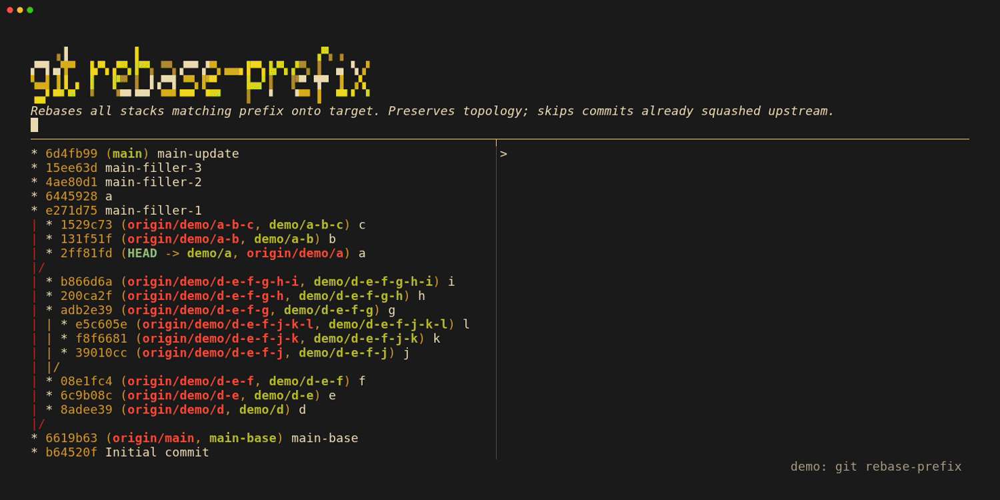
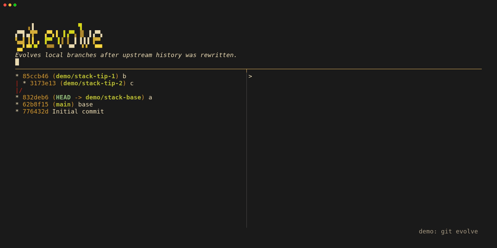
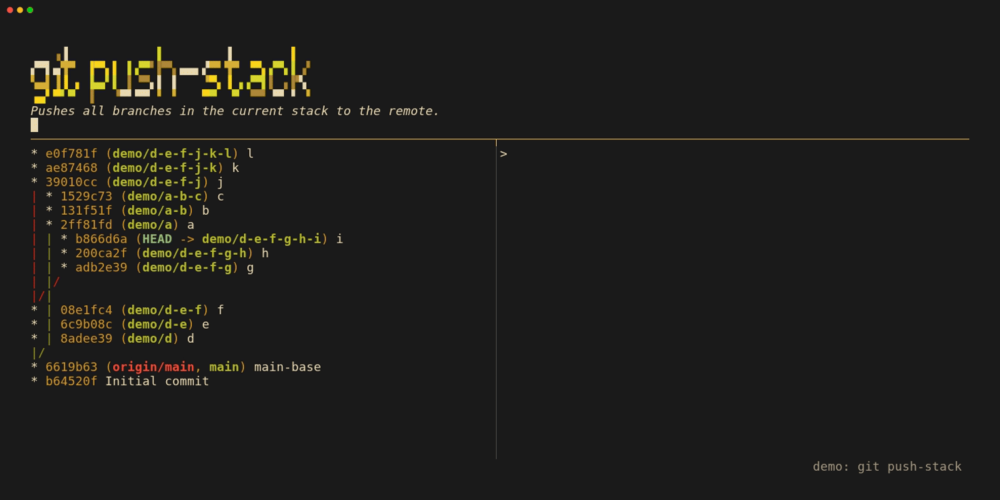
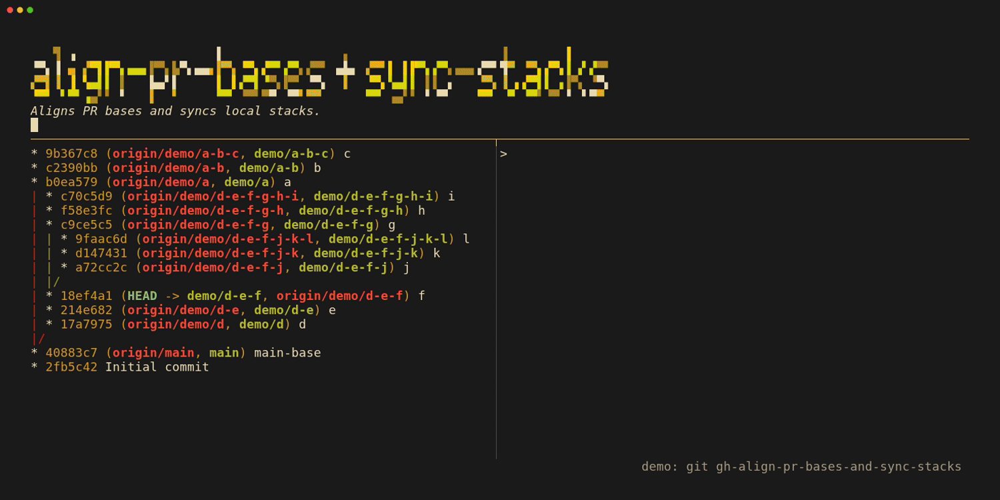
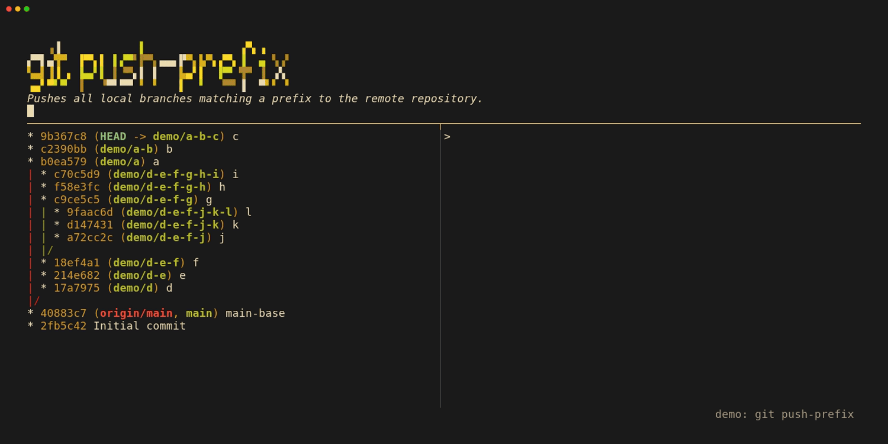
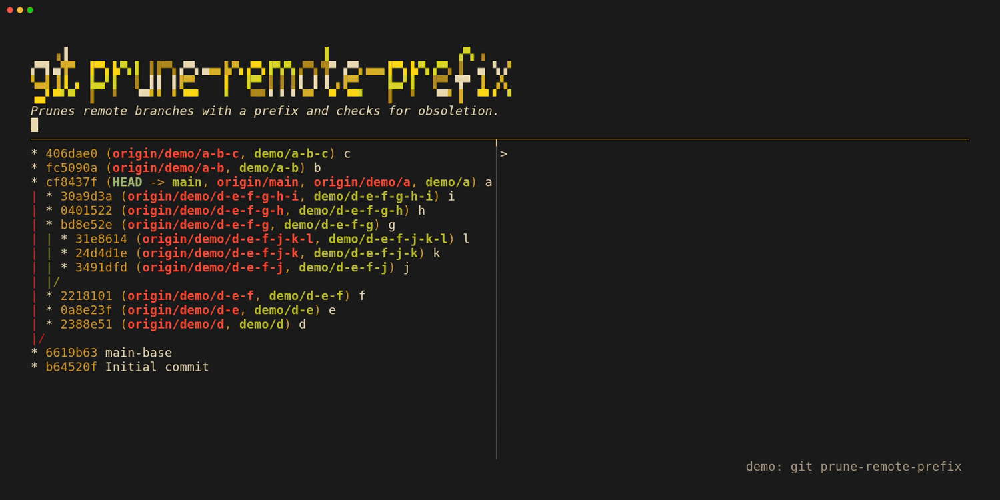
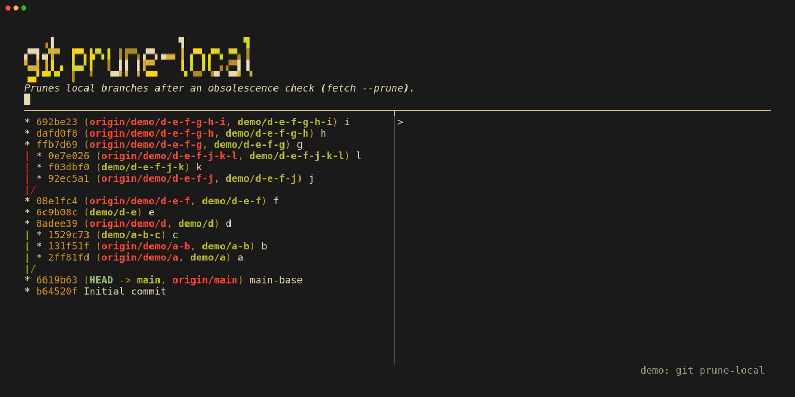

# Git Stack Utilities

[](https://github.com/methylDragon/git-scripts/actions/workflows/main.yml)
[](https://coveralls.io/github/methylDragon/git-scripts?branch=main)

A collection of scripts to wrangle branches, especially in a [stacked-diff](https://newsletter.pragmaticengineer.com/p/stacked-diffs) context in repos where the main branch keeps updating.

These scripts handle "obsolete" commits, merged commits, and branching histories relatively intelligently. Stack structure and branching are preserved, and any rebase issues are flagged and gracefully aborted for that stack.

## Demos

These tools are designed to streamline the workflow of managing [Stacked Pull Requests](https://newsletter.pragmaticengineer.com/p/stacked-diffs).

We'll showcase its usefulness with a typical workflow of trying to create a stack for GitHub.

We'll:

1. **Pull and rebase:** Pull the latest changes and rebase our stacks using `git stack rebase` or `git prefix rebase`.
1. **Evolve:** Rewire any orphaned stacks we generate if we ever need to amend using `git stack evolve` (or `git evolve`).
1. **Push:** Mass push branches in the stack using `git stack push` or `git prefix push`.
1. **Sync:** Now that the branches are on GitHub, automatically create PRs and align GitHub stacks using `git gh align` to match our stack topology.

### `git prefix rebase` *(demo shows legacy alias `git rebase-prefix`)*



### `git stack evolve` / `git evolve`



### `git stack push` *(demo shows legacy alias `git push-stack`)*



### `git gh align` *(demo shows legacy alias `git gh-align-pr-bases-and-sync-stacks`)*



We also have other functionalities for mass pushing beyond stacks, and cleaning up the local and remote repos!

<details>
<summary><b>View More Demos</b></summary>

### `git prefix push` *(demo shows legacy alias `git push-prefix`)*



### `git cleanup branches remote` / `git prefix prune` *(demo shows legacy alias `git prune-remote-prefix`)*



### `git cleanup branches local` *(demo shows legacy alias `git prune-local`)*



</details>

## Setup

1. **Install:** Run the automated installer, which clones the repo. *(It will automatically install [`pixi`](https://pixi.sh/) if you don't already have it.)*

   ```bash
   curl -sSL https://raw.githubusercontent.com/methylDragon/git-scripts/main/install.sh | bash
   ```

   **Note: Local Installation**

   If you have a local clone of this repository and want to install from it (useful for development), you can run this instead:

   ```bash
   ./install.sh --local
   ```

This sets up the environment and creates symlinks to `~/.local/bin` directly from your local clone.

1. **Verify:** Ensure `~/.local/bin` is in your system's `$PATH`.

The installer creates native Git subcommands! Because the executables are prefixed with `git-` and placed in your `PATH`, Git automatically recognizes them.

To update the scripts later, simply run:

```bash
git-scripts-update
```

## Usage

You can invoke these scripts just like native Git commands:

### Standard Git Utilities

Running any parent command (`git stack`, `git prefix`, `git cleanup`, `git gh`, or `git gk`) without arguments displays its available subcommands. The legacy hyphenated commands (`git rebase-stack`, `git rebase-prefix`, `git push-stack`, `git push-prefix`, `git prune-local`, `git prune-remote-prefix`, `git gh-align-pr-bases-and-sync-stacks`, `git gk-optimize`) remain available as aliases.

| Command                                                                                    | Description                                                                                                                                                                                                                                                                                                                                                                                                                                                                                                      |
| :----------------------------------------------------------------------------------------- | :--------------------------------------------------------------------------------------------------------------------------------------------------------------------------------------------------------------------------------------------------------------------------------------------------------------------------------------------------------------------------------------------------------------------------------------------------------------------------------------------------------------- |
| **`git stack rebase [target] [--all-worktrees] [--auto-delete]`**                          | **Stack Update.** Rebases the current branch's linear topological stack onto `target` (default: `main`). Preserves topology; skips commits already squashed upstream.                                                                                                                                                                                                                                                                                                                                            |
| **`git stack push [--target <branch>] [opts]`**                                            | **Stack Push.** Pushes all out-of-sync branches in the current topological stack (from trunk up to the tip). Passes extra args to `git push`.                                                                                                                                                                                                                                                                                                                                                                    |
| **`git stack evolve [old_hash]`** *(or **`git evolve [old_hash]`**)*                       | **Rescue Orphans.** Run immediately after `git commit --amend` to rebase child branches onto the new HEAD automatically. Calculates from reflog if `old_hash` is omitted.                                                                                                                                                                                                                                                                                                                                        |
| **`git prefix rebase <prefix> [target] [--all-worktrees] [--auto-delete]`**                | **Batch Update.** Rebases all stacks matching `prefix` onto `target` (default: `main`). Preserves topology; skips commits already squashed upstream.                                                                                                                                                                                                                                                                                                                                                             |
| **`git prefix push <prefix> [opts]`**                                                      | **Batch Push.** Pushes all branches matching `prefix`. Passes extra args (e.g., `--force-with-lease`) to `git push`.                                                                                                                                                                                                                                                                                                                                                                                             |
| **`git prefix prune <prefix> [target] [-n/--dry-run] [--also-prune-no-local]`**            | **Prefix Remote Cleanup.** Alias for `git cleanup branches remote`. Deletes remote branches matching `prefix` that are merged or squash-merged into `target`.                                                                                                                                                                                                                                                                                                                                                    |
| **`git cleanup branches local [target] [--prefix <pfx>] [-n] [--also-prune-no-upstream]`** | **Local Cleanup.** Deletes local branches whose remote tracking branches are gone (optionally scoped to `--prefix`). Use `--also-prune-no-upstream` to also prune branches lacking upstream tracking (checking obsolescence against `target`, default: `main`).                                                                                                                                                                                                                                                  |
| **`git cleanup branches remote <prefix> [target] [-n/--dry-run] [--also-prune-no-local]`** | **Remote Cleanup.** Deletes remote branches matching `prefix` that are fully merged or squash-merged into `target` (default: `main`). Use `--also-prune-no-local` to also delete branches lacking a local counterpart.                                                                                                                                                                                                                                                                                           |
| **`git gk <install/verify/uninstall> [repo] [--config] [--keep-recent-tags]`**             | **GitKraken Worktree Optimizer.** Improves GitKraken performance on large repositories and linked worktrees by pruning file-watcher directory traversal, making cached tab switches non-blocking, disabling commit detail panel transition lag in memory, retaining a rolling window of CI tags and remote release branches, enabling commit-graph and untracked-cache acceleration, and auto-refreshing linked worktrees. See [`src/git_scripts/gk/optimize/README.md`](src/git_scripts/gk/optimize/README.md). |

> **Note:** All commands support `--plain` (disables rich UI formatting) and `-y/--yes` (bypasses confirmation prompts).

### GitHub Utilities

These commands are strictly for GitHub repositories and require the [GitHub CLI (`gh`)](https://cli.github.com/) to be installed and authenticated (`gh auth login`).
**Recommended:** Install the [github/gh-stack](https://github.com/github/gh-stack) extension (`gh extension install github/gh-stack`) to automatically link PRs into stack tables of contents!

| Command                                                                       | Description                                                                                                                                                                                                                                                                                                                        |
| :---------------------------------------------------------------------------- | :--------------------------------------------------------------------------------------------------------------------------------------------------------------------------------------------------------------------------------------------------------------------------------------------------------------------------------- |
| **`git gh align [prefix] [target] [--current\|--all\|-i] [--remote <name>]`** | **GitHub PR Sync.** Modifies the base branch of GitHub Pull Requests to match your local topological history, prompts to push out-of-sync local branches or create missing PRs (populating repo PR templates automatically), and synchronizes `gh stack` links. Defaults to syncing the current branch's linear stack up to trunk. |

### Working with Worktrees

If you heavily utilize `git worktree` for stacked PRs, you might run into Git lock errors when trying to update a branch that is currently checked out in another worktree.

The `git stack rebase` and `git prefix rebase` commands accept an `--all-worktrees` flag, while `git evolve` (`git stack evolve`) handles worktrees **automatically**. When active, the tool detects if any branches in your stack are checked out in other worktrees. It safely detaches those worktrees, performs the complex topology rebases, and then cleanly re-checks out the updated branches in their original worktrees.

If you use **GitKraken Desktop** on Linux with linked worktrees, run `git gk install <repo>` (see [`src/git_scripts/gk/optimize/README.md`](src/git_scripts/gk/optimize/README.md)) to prevent GitKraken's file watcher from following child symlinks or indexing generated directories, eliminate `"Opening repo"` stalls on cached tab switches and commit detail panel slide-in lag, maintain a bounded rolling window for CI tags and remote release branches, shrink bloated `repoSettings` files, and automatically refresh the commit graph after terminal Git commands.

## Testing

This repository uses `pytest` for unit testing the Python logic and `absltest` for parameterization. We also use `pytest-xdist` to speed up tests by running them in parallel.

1. **Install dependencies:**
   `pixi install` will automatically handle all required dependencies.

1. **Run tests:**

   ```bash
   pixi run test
   ```

## Development

If you'd like to contribute to this project, we enforce formatting (`ruff-format`) and linting (`ruff`) for Python files, as well as `markdownlint` and shell linting/formatting via `prek`.

1. **Install dependencies and hooks:**
   Everything is managed via `pixi`. Remember to run `pixi install` if you cloned this repository.

   ```bash
   pixi run setup
   ```

   Now, every time you commit, it will automatically check your scripts.

1. **Run manually:**
   You can trigger formatting and linting across all files without committing by running:

   ```bash
   pixi run lint
   ```
