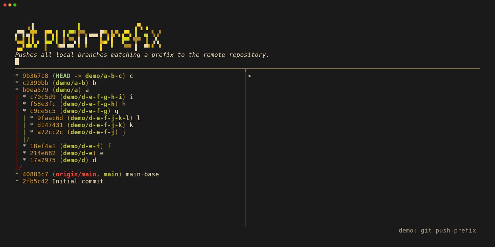
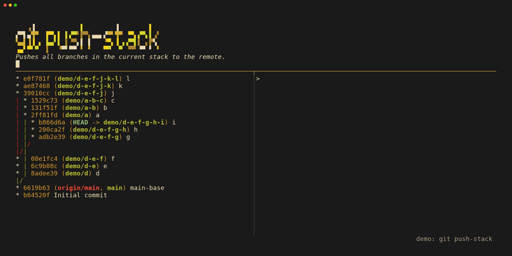
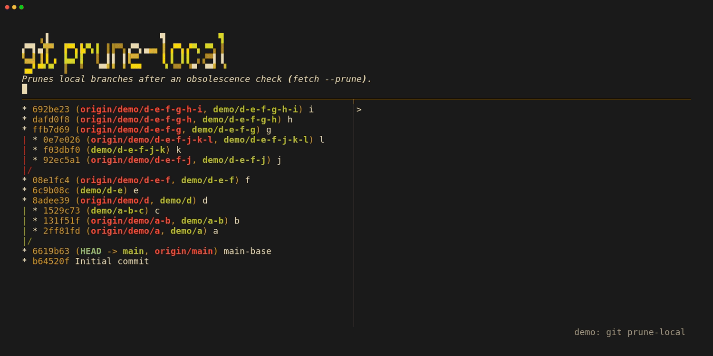
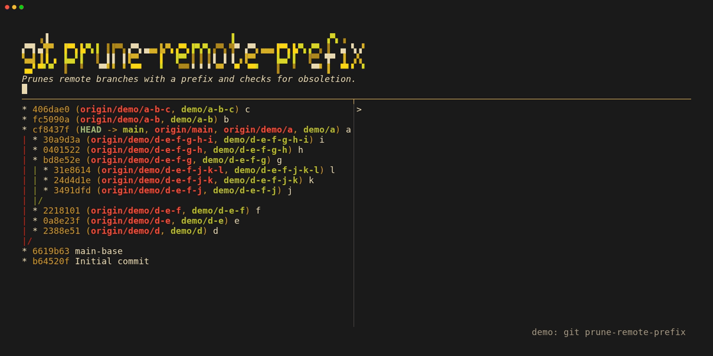
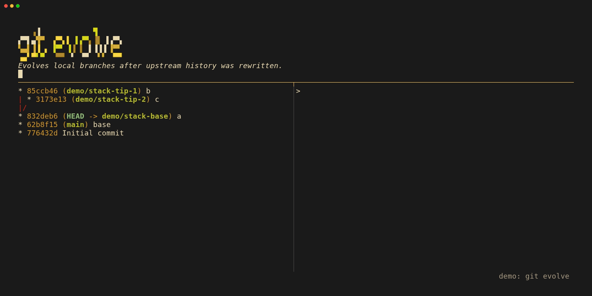
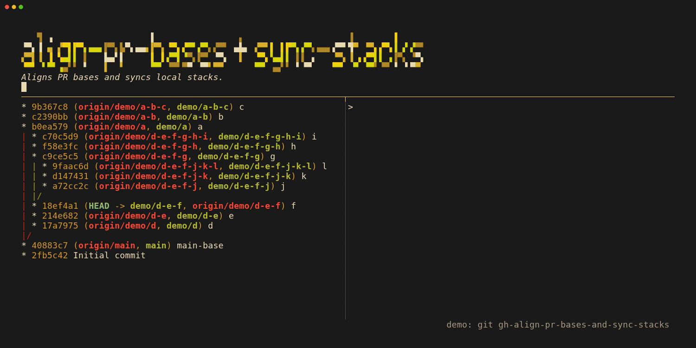

# Media Generation

This directory contains scripts and VHS tapes to generate demo GIFs for `git-scripts`.

## Tools Used

- **[vhs](media/https://github.com/charmbracelet/vhs)**: Used to script and record the terminal interactions.
- **git log (or git-graph)**: Used to visually display the branching tree before and after command executions.

## Scenarios

- `git push-prefix`: Pushes all local branches matching a prefix to the remote repository.
  

- `git push-stack`: Pushes all branches in the current stack to the remote.
  

- `git prune-local`: Prunes local branches whose remote tracking branches are gone.
  

- `git prune-remote-prefix`: Prunes remote branches with a specific prefix.
  

- `git evolve`: Evolves local branches after upstream history was rewritten.
  

- `git gh-align-pr-bases-and-sync-stacks`: Aligns GitHub PR bases and syncs local stacks.
  

## Generating GIFs

To generate the GIFs, you need `vhs` and `pixi` installed.

```bash
# Run all of them in parallel
pixi run media-gen-all

# Or run a specific tape
pixi run media-gen media-gen/tapes/rebase_prefix.tape
```
